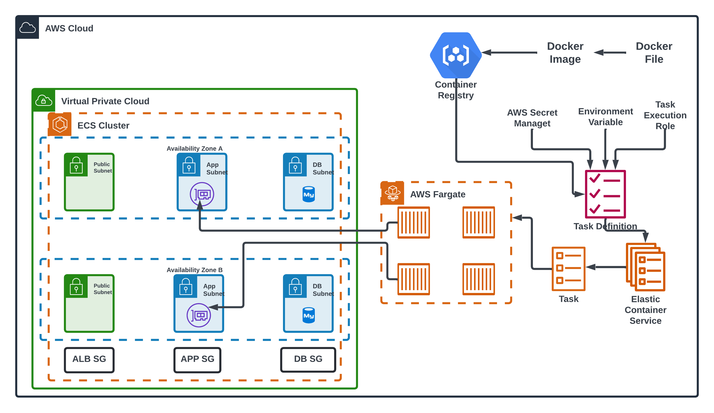
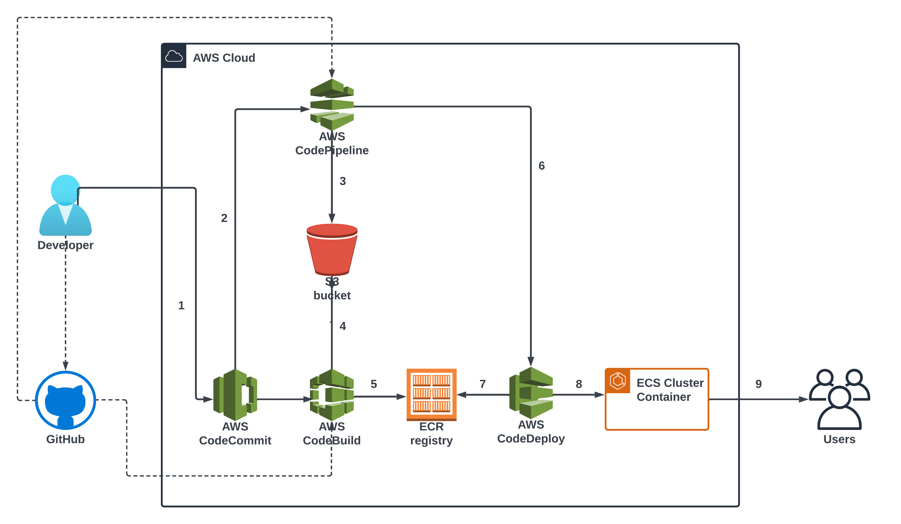

# Deploying simple html template on AWS ECS Fargate with AutoScaling and LoadBalancing automatically with CI/CD
## Launch and Deploy WebApp Image to AWS Fargate.

### STEP-1: Building VPC
1. Create a VPC.
2. Select "VPC and More"
3. Give "IPv4 CIDR Block"
4. No. of AZ's : 2
5. No. of Public Subnet: 2
6. No. of Private Subnet: 4
7. NAT Gateway: In 1 AZ (for Demo_Purpose only, for real project select "1 per AZ" for HA)
8. Select "Customize Subnets CIDR Blocks":
   1. Public Subnet in ap-southeast-1a: ``` 10.0.1.0/24 ```
   2. Public Subnet in ap-southeast-1b: ``` 10.0.2.0/24 ```
   3. Public Subnet for App in ap-southeast-1a: ``` 10.0.10.0/24 ```
   4. Public Subnet for App in ap-southeast-1b: ``` 10.0.11.0/24 ```
   5. Public Subnet for DB in ap-southeast-1a: ``` 10.0.20.0/24 ```
   6. Public Subnet for DB in ap-southeast-1b: ``` 10.0.21.0/24 ```
9. VPC endpoints: "None" (for Demo Project only)
10. Finally Select "Create VPC"

### STEP-2 : Create a SG for ALB, APP and DB

1. For ALB:
   1. Select SG from VPC Console.
   2. Create SG.
   3. Give Name for SG: bishal_demo-project_SG-ALB
   4. Give Description also.
   5. Select your VPC:
   6. Add Inbound Rules:
      1. Add rule.
      2. In Type: Select HTTP
      3. Source: Anywhere_IPv4
    7. Create SG.
2. For APP:
   1. Same as above.
   2. In Inbound Rule:
      1. In Type: Select HTTP
      2. Source: Custom: LB_SG_ID (Select it in drop-down)
   3. Create SG.
3. For DB:
   1. same.
   2. In Inbound Rule:
      1. In Type: Select "MYSQL/AURORA"
      2. Source: Custom: APP_SG_ID

### STEP-3 : Creating ECR Repository
1. Select "Repositories" from ECR Console.
2. Create repository
3. Give Repository Name: bishaldhimal_demo-project_Repository
4. Create Repository

### STEP-4 : Building Docker Image
#### Prerequisite:
1. Install docker on local machine.
2. Install AWS CLI

#### Let's us create EC2 and connect it using session manager because it is more secure way to remote connect because it doesnot requires ports like 22(ssh) and 3389(RDP) to open.

1. To use Session Manager, we require some roles:
   1. Goto IAM console.
   2. Select Roles
   3. Create Roles
   4. Trusted Entity Type: AWS Service
   5. Use Case: EC2
   6. Next
   7. In Permission Policies: Search "AmazonSSMManagedInstanceCore" and select it. (It allows to remotely connect to an instance using session manager.)
   8. Again, search "EC2InstanceProfileForImageBuilderECRContainerBuilds" and select it. (it allows to upload ECR images.)
   9. Next
   10. Give Role_Name: IAM_Grant_EC2_SSM_and_ECR_ACCESS_bishal
   11. Create Role.
  
2. Goto EC2 Console.
   1. Launch Instance.
   2. Give Name: Bishal_Instance_Building_Docker_Image
   3. AMI: Amazon Linux
   4. Select "Right VPC"
   5. Select Private Subnet in APP
   6. SG: Select Default SG because it doesn't require anh inbound_rules, because we are using session manager.
   7. In Advance Details:
      1. IAM Instance Profile: Select Above Created Role for EC2.
   8. Select "Launch Instance"
  
3. If EC2 is created and is in running state:
   1. Select it.
   2. Select Connect.
   3. Select "Session Manager"  
   4. Connect
   5. After connect to EC2, switch user to local user:
      ```
      sudo su - ec2-user
      pwd
      sudo yum update -y
      sudo yum install docker -y
      sudo service docker start
      sudo service docker enable
      sudo chmod -a -G docker ec2-user 
      ```
   6. To activate it: logout(Exit) and Exit and Connect again.
      ```
      sudo su - ec2-user
      pwd
      git clone git_repo_url
      vi Dockerfile

      docker build -t <uri_of_ECS_registry> .
      docker images
      ```
      ###### Pushing Image to ECR Repository:
      - Click on ECR repository name
      - view push commands: (Gives quick access to the cmds that we need to run)
      - Run (cmd 1 and 4 only, because we already build docker image) on EC2

#### Alternate: To push the image to DockerHub:

1. Creating Image usign Dockerfile: ``` docker build -t image_name . ```
2. Runnign Image and Exposing : ``` docker run -dp 80:80 image_name

#### To push the image on dockerhub:
```
docker login -u <dockerhub_username>
docker build -t <dockerhub_username>/<image_name>:tag .
docker push <dockerhub_username>/<image_name>:tag
```
### STEP-5: Creating TG For ALB
1. Goto EC2 DashBoard
2. Select TG
3. Create TG
4. Choose a TG: IP_Address (ECS fargate requires IP for targets)
5. Give TG_Name: bishal_Demo-project-TG_ALB
6. Select "Right VPC"
7. Next
8. Specify IP's and Define Ports: remove all
9. Create TG

### STEP-6: Create an Application Load Balancer 
1. Create a LB
2. Select ALB
3. Create
4. Give_Name_LB: bishal_ALB_demo-project
5. Network Mapping:
   1. VPC: Select Your VPC
6. Mappings:
   1. Tick your AZ's and Select your public subnet (Imp.)
   2. For SG: Select your ALB_SG
   3. In listeners and routing: Select your TG
7. Create LB.

### STEP-7: IAM Roles and Policies for ECS Tasks (One Role with couple of Policies)
1. Goto IAM Dashboard
2. Select Policies: for Secret_Manager (DB)
3. Create Policy:
   1. Select Secret Manager
   2. In Actions allowed: getsecretvalue
   3. In Resources : Tick Specific and Add ARNs
   4. Copy Secret_ARN from Secret_Manager_Secrets_of_DB
   5. Next
   6. Give Policy_Name: bishal-allow-read_db_secrets-Policy
   7. Create Policy

### STEP-8: Create an Amazon ECS cluster
1. Goto ECS Dashboard
2. Create Cluster
3. Give ClusterName: bishal_ECS_Cluster_Fargate
4. In Infrastructure: Select "AWS Fargate"
5. Create

### STEP-9: Create ECS Task Definition
1. Create TD
2. Give_Name: bishal_ECS_TD
3. In launch Type: AWS Fargate
4. Specify Task_Size:
   1. CPU: 0.5 vCPU
   2. Memory: 1 GB
6. Select above_create "Task Role" for Task Role as well as Execution Role ie. same role for both.
7. In Next Section: Container details:
   1. Name: bishal_container
   2. Image URI: paste the URI of ECR image that we uploaded
8. Port Mapping: HTTP with port 80
9. Define Environment Variable (for DB)
10. Click "Create"
#### * Note: Task Placement is necessary to production. so, study docs.

### STEP-10: Create an ECS Service (which will deploy those containers into our cluster and we should be able to access our application.)

1. Goto ECS Cluster Console.
2. Click your cluster
3. In Service Tab:
   1. Create
   2. In Compute Options: Launch_Type
      1. Launch Type: FARGATE
   3. In Task Definition:
      1. Family: <Select_your_TD>
      2. REVISION: latest
      3. Service_Name: bishal_ECS_Service
   4. Service Type: Replica
   5. Desired Task: 1 (for test), in real project choose acc. to your specific needs.
   6. Expand Networking:
      1. Select Your VPC
      2. In subnets: Make sure to select only the app_subnet
      3. In SG: Select app_SG
      4. Public_IP: Turned off(close)
   7. Expand LB:
      1. Select ALB
      2. Use an existing LB
      3. choose your LB
      4. use existing listner: Select 80:HTTP
      5. use existing TG: your_TG
   8. Expand Service_Auto_Scaling:
      1. Tick use ServiceAutoScaling
      2. Min. Task: 1
      3. Max. Task: 4
      4. Scaling Policy Type: Target Tracking
      5. Policy_Name: bishal_ServiceAutoScaling_Policy-ECS
      6. ECS Service Metric: ECSServiceAvgCPUUtilization
      7. TargetValue: 70
      8. Scale_out_cool_down_period: 300
      9. Scale_in_cool_down_period: 300
4. Finally Click "Create"
   
## CI/CD Pipeline for AWS ECS using CodeCommit, CodeBuild and CodePipeline.


### STEP-1: CodeCommit
1. Goto AWS CodeCommit
2. Create Repository
3. Give Repository_Name: bishal-cicd-fargate-project-repo
4. Create
#### * Push Code to CodeCommit Repo:
1. Goto IAM DashBoard
2. Select your user
3. Add Permissions
4. Attach Policies directly
5. In Permission Policies Section: Search "AWSCodeCommitAccess" and select it.
6. Add permission
7. Select Security_Credentials: Inorder to push our code to codecommit we need to crete a git credentials.
8. Select "Generate Credentials" for HTTPS Git Credentials for AWS CodeCommit.
9. Click "Clone URL" to copy teh url of repo:
   1. Select Clone HTTPS
  
#### On Local Machine
1. git clone repo_url
2. we need to paste above generate git_credentials
3. Copy all the application contents to the clone repo_directory
4. cp application_code/* clone_repo_directory/
5. cd clone_repo_dir
6. touch Dockerfile buildspec.yml
7. git add -- .
8. git commit -m "add Dockerfile and buildspec.yml file"
9. git push (requires above generated git-credentials)
    
### STEP-2: CodeBuild
1. Goto AWSCodeBuild
2. Select Getting started from Build Section
3. Create Project
4. Give Poject_Name: bishal_Demo-Project_CodeBuild
5. In Source1 - Primary Section:
   1. Source Provider: AWS CodeCommit
   2. Repository: Select your repo
   3. Reference Type: Branch
   4. Branch: main
   5. Operating System: Amazon Linux
   6. RunTimes(s): standard
   7. Image: latest image of code build
6. In Additional Configuration (Drop-Down)
   1. Timeout: 10 min
   2. Tick Privileged
7. Finally Click "Create"

#### *Note: Attaching a ECR policy or permission to CodeBuild
1. Select your CodeBuild Project
2. Build Details
3. In Environment Section:
   1. Select Service Role
   2. Add Permissions
   3. Attach Policies
   4. Search for AmazonEC2ContainerRegistryFullAccess
4. ADD Permissions

### STEP-3: CodePipeline
1. Select Pipeline
2. Select Getting Started
3. Create Pipeline
4. Give Pipeline_Name: bishal-cicd-fargate-Pipeline
5. Next
6. Source Provider: AWS CodeBuild
7. Repo_Name: Choose your repo
8. Branch_Name: Choose your branch
9. Next
10. Build Provider: AWS CodeBuild
    1. Region: your_region
11. Project Name: ur_build_project_name
12. Select "Add Environment Variable" and fill the environment variable of your buildspec.yml file environment variables.
13. Next
14. Deploy Provider: Amazon ECS
    1. Cluster_Name: Select "your_cluster"
    2. Service_Name: Select "your service name of ECS"
15. Next
16. Create Pipeline

